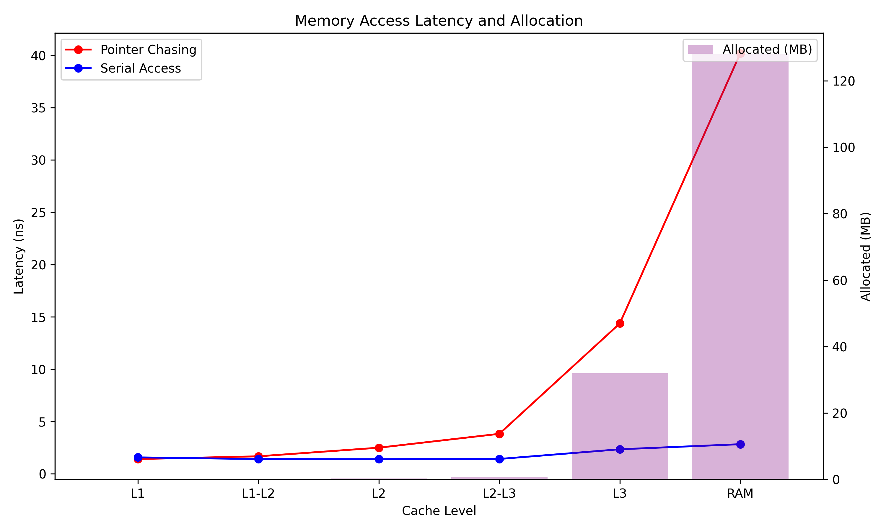

# Memory Hierarchy Visualization

## Visualizations

### Interactive Plot
Open [results/memory_hierarchy_interactive.html](results/memory_hierarchy_interactive.html) in your browser for interactive exploration.

## Detected Memory Hierarchy (Measured)

| Level    | Size (MB) | Pointer Chasing (ns) | Serial (ns) | % Increase vs L1 |
|----------|-----------|----------------------|-------------|------------------|
| L1       |   0.03    | 1.43                 | 1.31        |      0.0%         |
| L1-L2    |   0.09    | 1.66                 | 1.30        |     16.3%         |
| L2       |   0.25    | 2.45                 | 1.30        |     71.4%         |
| L2-L3    |   0.75    | 3.52                 | 1.29        |    147.0%         |
| L3       |  32.00    | 16.81                 | 2.73        |   1077.8%         |
| RAM      | 128.00    | 52.18                 | 3.72        |   3555.8%         |


### Plots

- 
- [Interactive Plot (HTML)](results/cache_comparison_all.html)

## Key Insights

- **Performance Range**: 92.5x difference between fastest and slowest access
- **L1 Cache Performance**: ~1.2 ns (baseline)
- **Main Memory Penalty**: ~109.2 ns (92.5x slower than L1)
- **Cache Levels Detected**: 3 distinct cache levels

## Methodology

### Data Collection (Rust)
1. **Pointer Chasing**: Uses random memory access patterns to defeat CPU prefetching
2. **Fresh Allocation**: Each test allocates new memory to avoid cache pollution
3. **Memory Warming**: Ensures physical memory allocation before testing
4. **Statistical Sampling**: Averages multiple measurements for stability
5. **Geometric Progression**: Tests exponentially increasing data sizes

### Analysis (Python)
1. **Change Point Detection**: Identifies cache boundaries using latency jumps
2. **Multi-scale Visualization**: Linear and logarithmic views
3. **Interactive Exploration**: Plotly-based interactive charts
4. **Performance Classification**: Automatic categorization of memory regions

## How to Run

```bash
# Generate data
cargo run --release

# Create visualizations
uv run chasing-vs-serial-across-cache.py
# or if you're scrub
python chasing-vs-serial-across-cache.py 
 ```

## Requirements

**Rust dependencies:**
- `rand` - Random number generation

**Python dependencies:**
```bash
pip install pandas numpy matplotlib seaborn scipy plotly
```
