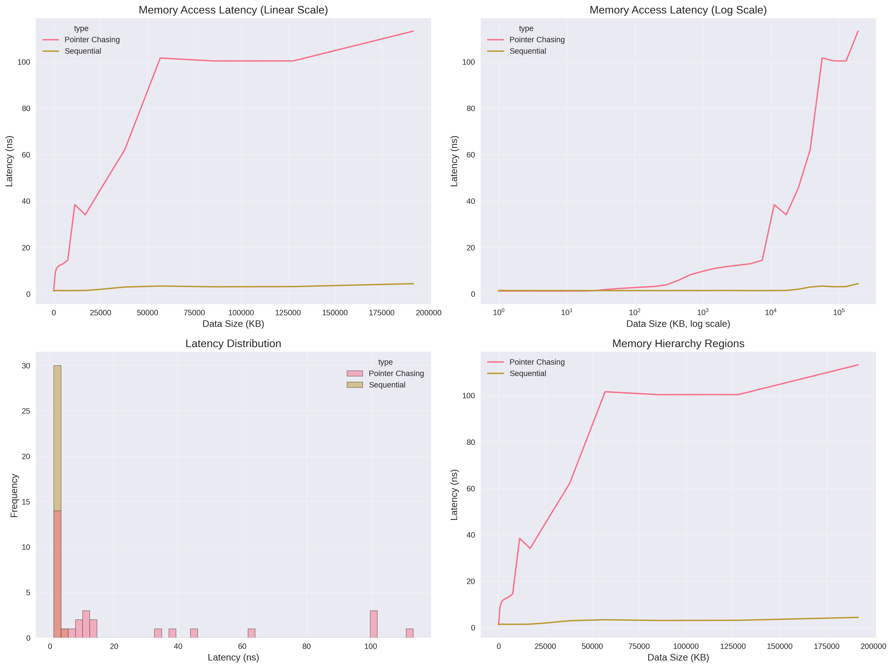

# Memory Hierarchy Visualization

## Visualizations

### Static Analysis


### Interactive Plot
Open [results/memory_hierarchy_interactive.html](results/memory_hierarchy_interactive.html) in your browser for interactive exploration.

## Detected Memory Hierarchy

| Level | Size Range | Avg Latency | Performance |
|-------|------------|-------------|-------------|
| L1 Cache | 0.0 MB - 7.3 MB | 13.5 ns | 🟡 Good |
| L2 Cache | 7.3 MB - 11.0 MB | 15.2 ns | 🟡 Good |
| L3 Cache | 11.0 MB - 16.4 MB | 18.2 ns | 🟡 Good |
| Main Memory | 16.4 MB - 187.3 MB | 85.2 ns | 🟠 Moderate |

## Key Insights

- **Performance Range**: 92.5x difference between fastest and slowest access
- **L1 Cache Performance**: ~1.2 ns (baseline)
- **Main Memory Penalty**: ~109.2 ns (92.5x slower than L1)
- **Cache Levels Detected**: 3 distinct cache levels

## Methodology

### Data Collection (Rust)
1. **Pointer Chasing**: Uses random memory access patterns to defeat CPU prefetching
2. **Fresh Allocation**: Each test allocates new memory to avoid cache pollution
3. **Memory Warming**: Ensures physical memory allocation before testing
4. **Statistical Sampling**: Averages multiple measurements for stability
5. **Geometric Progression**: Tests exponentially increasing data sizes

### Analysis (Python)
1. **Change Point Detection**: Identifies cache boundaries using latency jumps
2. **Multi-scale Visualization**: Linear and logarithmic views
3. **Interactive Exploration**: Plotly-based interactive charts
4. **Performance Classification**: Automatic categorization of memory regions

## How to Run

```bash
# Generate data
cargo run --release

# Create visualizations
python visualize.py
```

## Requirements

**Rust dependencies:**
- `rand` - Random number generation

**Python dependencies:**
```bash
pip install pandas numpy matplotlib seaborn scipy plotly
```
